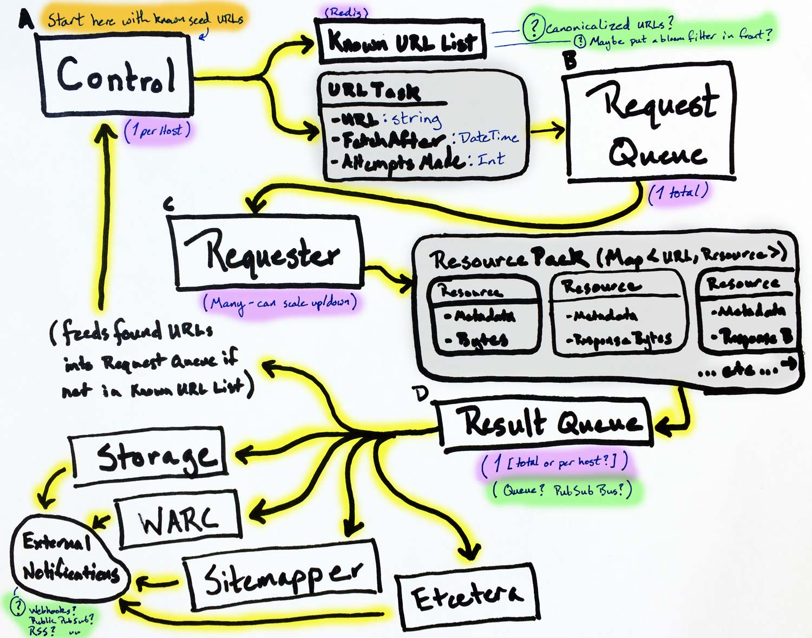

# Walk

[](http://godoc.org/github.com/qri-io/walk)
[](./LICENSE)
[](https://codecov.io/gh/qri-io/walk)
[](https://circleci.com/gh/qri-io/walk)

Walk is a system for scraping a BIG list of URLs (or a whole host/origin) and processing the results in multiple ways.



(System components are in square-edged boxes, while the format of data being sent between them is in round-edged boxes. Open questions highlighted in green.)

### Building From Source

To build walk you'll need the [go programming language](https://golang.org) on your machine.

```shell
$ go get github.com/qri-io/walk
$ cd $GOPATH/src/github.com/qri-io/walk
$ make install
```

---

* NDJSON (nweline delimited JSON)

short term
  * reliably scrape a _set_ of urls
  * fire off an event / webhook / etc when a URL returned a different hash this time than last time

long term:
  * instead of a url, a host
  * just going after _every_ url of a host

Scaling down to a set of pages is a prioritization mechanism for analysts (human thing), not a computer problem

Thing rob had started writing:

* some control node shoving urls onto a queue
* workers are eating off the queue
* writing in javascript b/c instead of parsing a url, automating chrome headless
* system would be able to classify what is a resource vs a subresource
  * knowing what came as part of a request generated by a page
  * store the subresource
* versionista _only_ captures the HTML (immideate response)
  * sub-resource repsonse match problems

* we'd have to be able to keep track of sitemaps from each crawl
* store in a separate list the versions of each page
* WM really only cares about each time a page changes, _but_ we'd like to be able to get not just the changes but a log of _when_ the page change
* in terms of storage, content-addressing is our friend
* importantly we do want a record of all times we checked or scraped a page
* it's not just "there was a new version", but the _time window in which change occurred_

Current Design:
* a control node is adding urls to a queue
* workers eat off the queue
* as workers are snapshotting, they're sending links to the control node


Concerns:
* these lists of urls are _looooong_
* checking for presence in the list fast & reliably well
* redis does that _real good_


### Architecture:
* something that holds a list of urls in crawl
* something that holds a queue of urls to scrape
* worker's output is _n_ resources and _m_ sub-resources
  * the only difference is we tag sub-resources as such so users can 
  * disambiguate links to subresources vs links to another page: what's a link to another page vs a link to a resource the page needs
  * worker does initial processing, turns it into CBOR
  * worker sends 

### TODO:
* redirects should be a slice of the full chain


RequestTask:
* url
* fetchAfter
* attemptsMade


